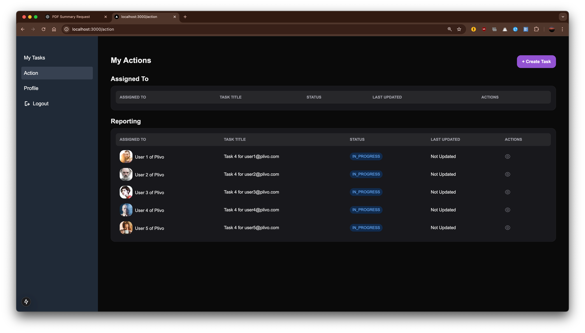
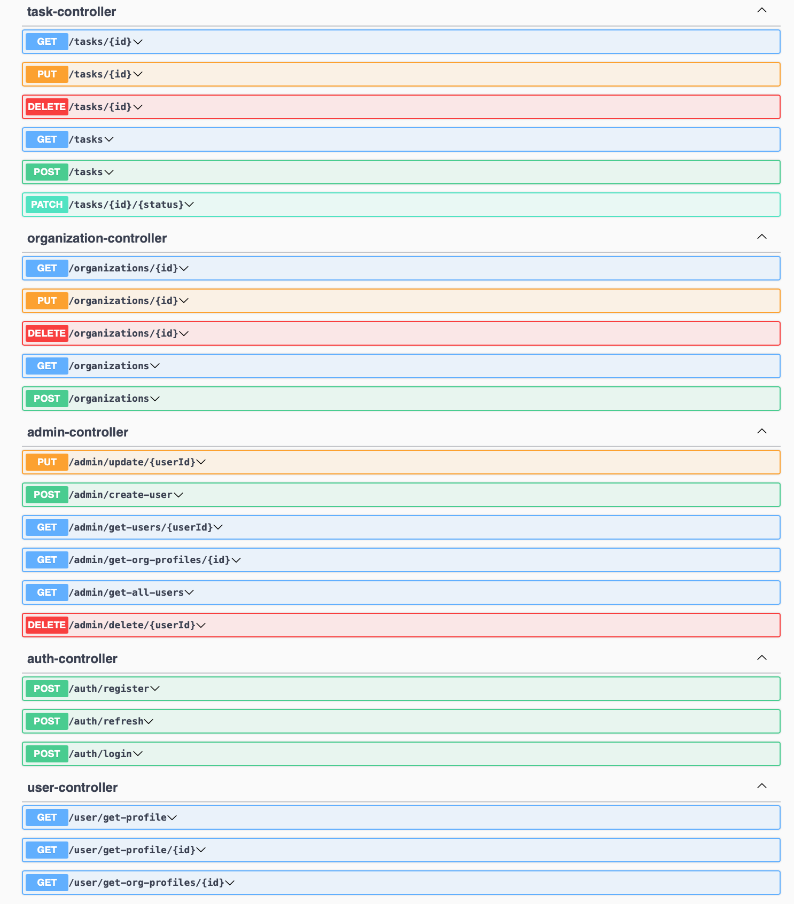
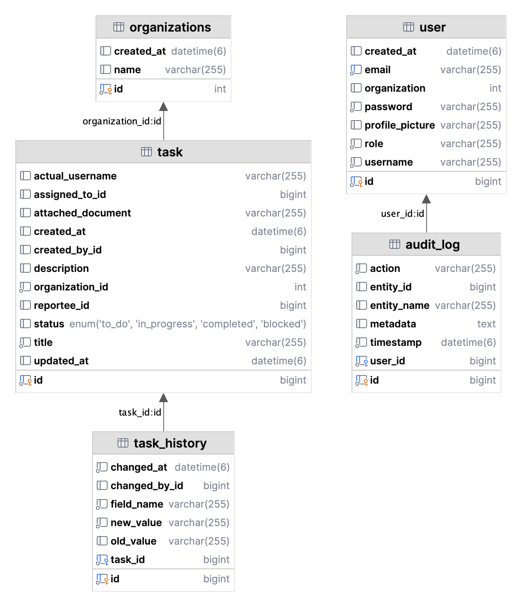

# Task Management System Report

## Table of Contents

## 1. INTRODUCTION

### 1.1 Project Overview/Specifications

The Task Management System is a full-stack web application built using Spring Boot and Next.js that enables organizations to efficiently manage tasks and workflows. The system supports multiple organizations, user roles (Admin and User), and provides features like task creation, assignment, status tracking, and a Kanban board interface.

Key Features:

- User authentication and authorization
- Organization-specific task management
- Role-based access control
- Kanban board for task visualization
- Real-time task status updates
- User profile management

### 1.2 Motivations

- Need for organization-specific task management
- Improving team collaboration and workflow visibility
- Streamlining task assignment and tracking
- Providing real-time status updates
- Supporting multiple user roles and permissions

### 1.3 Uniqueness of the Work

1. Organization-Centric Approach:

[28:44](backend/src/main/java/com/taskify/app/utils/PopulateDB.java)

```java
    public CommandLineRunner createDummyOrganizations(OrganizationRepository organizationRepository) {
        return args -> {
            List<Organizations> organizations = Arrays.asList(
                new Organizations(1, LocalDateTime.now(), "Epam Systems"),
                new Organizations(2, LocalDateTime.now(), "Samsung R&D"),
                new Organizations(3, LocalDateTime.now(), "Plivo"),
                new Organizations(4, LocalDateTime.now(), "Affinsys AI")
            );

            for (Organizations org : organizations) {
                if (!organizationRepository.existsById(org.getId())) {
                    organizationRepository.save(org);
                    System.out.println("Created Organization: " + org.getName());
                }
            }
        };
    }
```

2.Real-time Kanban Board:

[23:82](frontend/components/custom/kanban-board.jsx)

```java
const KanbanBoard = () => {
  const [data, setData] = useState({
    tasks: {},
    columns: {
      "column-1": { id: "column-1", title: "To do", taskIds: [] },
      "column-2": { id: "column-2", title: "In-progress", taskIds: [] },
      "column-3": { id: "column-3", title: "Done", taskIds: [] },
    },
    columnOrder: ["column-1", "column-2", "column-3"],
  });

  const fetchTasks = async () => {
    try {
      const token = localStorage.getItem("token");
      const response = await axios.get("http://localhost:8080/tasks", {
        headers: {
          Authorization: `Bearer ${token}`,
        },
      });

      const tasks = response.data;
      const newTasks = {};
      const toDoTaskIds = [];
      const inProgressTaskIds = [];
      const completedTaskIds = [];

      tasks.forEach((task) => {
        if (task.assignedToId == localStorage.getItem("userid")) {
          newTasks[task.id] = { id: task.id.toString(), content: task.title };
          if (task.status === "TO_DO") {
            toDoTaskIds.push(task.id.toString());
          } else if (task.status === "IN_PROGRESS") {
            inProgressTaskIds.push(task.id.toString());
          } else if (task.status === "COMPLETED") {
            completedTaskIds.push(task.id.toString());
          }
        }
      });

      const newData = {
        tasks: newTasks,
        columns: {
          "column-1": {
            ...data.columns["column-1"],
            taskIds: toDoTaskIds,
          },
          "column-2": {
            ...data.columns["column-2"],
            taskIds: inProgressTaskIds,
          },
          "column-3": {
            ...data.columns["column-3"],
            taskIds: completedTaskIds,
          },
        },
        columnOrder: data.columnOrder,
      };

      setData(newData);
    } catch (error) {
```

3.Role-Based Access Control:

[36:40](backend/src/main/java/com/taskify/app/config/SecurityConfig.java)

```java
    @Bean
    public SecurityFilterChain securityFilterChain(HttpSecurity httpSecurity) throws Exception{
        httpSecurity.csrf(AbstractHttpConfigurer::disable)
                .cors(Customizer.withDefaults())
                .authorizeHttpRequests(request-> request.requestMatchers("/auth/**", "/public/**", "/swagger-ui/**", "/v3/api-docs", "/v3/api-docs/swagger-config").permitAll()
                        .requestMatchers("/admin/**").hasAnyAuthority("ADMIN")
                        .requestMatchers("/user/**").hasAnyAuthority("USER", "ADMIN")
                        .requestMatchers("/adminuser/**").hasAnyAuthority("ADMIN", "USER")
                        .anyRequest().authenticated())
                .sessionManagement(manager->manager.sessionCreationPolicy(SessionCreationPolicy.STATELESS))
                .authenticationProvider(authenticationProvider()).addFilterBefore(
                        jwtAuthFilter, UsernamePasswordAuthenticationFilter.class
                );
        return httpSecurity.build();
    }
```

## 2. LITERATURE SURVEY

### 2.1 Existing System

The project builds upon established task management principles while implementing modern technologies and practices:

- JWT-based authentication
- RESTful API architecture
- Responsive UI with Next.js
- Database persistence with JPA/Hibernate

### 2.2 Problem Identification

Key challenges addressed:

1. Multi-organization support
2. Role-based access control
3. Real-time task status updates
4. User management
5. Task assignment workflow

## 3. MATERIALS AND METHODS

### 3.1 Description

The system is built using a microservices architecture with:

Backend:

- Spring Boot
- Spring Security
- JPA/Hibernate
- MySQL

Frontend:

- Next.js
- NextUI Components
- TailwindCSS
- Axios for API communication

### 3.2 Schematic Layout

The application follows a three-tier architecture:

1. Presentation Layer (Next.js Frontend)

  
2. Business Logic Layer (Spring Boot Backend)


3. Data Layer (MySQL Database)


### 3.3 Methods Used

1. Authentication

32:46:backend/src/main/java/com/taskify/app/config/SecurityConfig.java

```java
    @Bean
    public SecurityFilterChain securityFilterChain(HttpSecurity httpSecurity) throws Exception{
        httpSecurity.csrf(AbstractHttpConfigurer::disable)
                .cors(Customizer.withDefaults())
                .authorizeHttpRequests(request-> request.requestMatchers("/auth/**", "/public/**", "/swagger-ui/**", "/v3/api-docs", "/v3/api-docs/swagger-config").permitAll()
                        .requestMatchers("/admin/**").hasAnyAuthority("ADMIN")
                        .requestMatchers("/user/**").hasAnyAuthority("USER", "ADMIN")
                        .requestMatchers("/adminuser/**").hasAnyAuthority("ADMIN", "USER")
                        .anyRequest().authenticated())
                .sessionManagement(manager->manager.sessionCreationPolicy(SessionCreationPolicy.STATELESS))
                .authenticationProvider(authenticationProvider()).addFilterBefore(
                        jwtAuthFilter, UsernamePasswordAuthenticationFilter.class
                );
        return httpSecurity.build();
    }
```

2. Task Management:

[53:71](backend/src/main/java/com/taskify/app/service/TaskService.java)

```java
    public List<Task> getAllTasks() {
        Authentication authentication = SecurityContextHolder.getContext().getAuthentication();
        String email = authentication.getName();
        Optional<User> userOptional = userRepository.findByEmail(email);
        if (userOptional.isPresent()) {
            User currentUser = userOptional.get();
            List<Task> tasks;
            if ("ADMIN".equals(currentUser.getRole())) {
                tasks = taskRepository.findAll().stream()
                    .filter(task -> currentUser.getOrganization().equals(task.getOrganizationId()))
                    .collect(Collectors.toList());
            } else {
                Long userId = currentUser.getId();
                tasks = taskRepository.findAll().stream()
                    .filter(task -> userId.equals(task.getAssignedToId()) ||
                                    userId.equals(task.getCreatedById()) ||
                                    userId.equals(task.getReporteeId()))
                    .collect(Collectors.toList());
            }
```

### 3.4 Tools Used

1. Development Tools:

19:87:backend/pom.xml

```xml
 <dependencies>
  <dependency>
   <groupId>org.springframework.boot</groupId>
   <artifactId>spring-boot-starter-data-jpa</artifactId>
  </dependency>
  <dependency>
   <groupId>org.springframework.boot</groupId>
   <artifactId>spring-boot-starter-security</artifactId>
  </dependency>
  <dependency>
   <groupId>org.springframework.boot</groupId>
   <artifactId>spring-boot-starter-web</artifactId>
  </dependency>

  <dependency>
   <groupId>com.mysql</groupId>
   <artifactId>mysql-connector-j</artifactId>
   <scope>runtime</scope>
  </dependency>
  <dependency>
   <groupId>org.projectlombok</groupId>
   <artifactId>lombok</artifactId>
   <optional>true</optional>
  </dependency>
  <dependency>
   <groupId>org.springframework.boot</groupId>
   <artifactId>spring-boot-starter-test</artifactId>
   <scope>test</scope>
  </dependency>
  <dependency>
   <groupId>org.springframework.security</groupId>
   <artifactId>spring-security-test</artifactId>
   <scope>test</scope>
  </dependency>

  <!-- https://mvnrepository.com/artifact/io.jsonwebtoken/jjwt-impl -->
  <dependency>
   <groupId>io.jsonwebtoken</groupId>
   <artifactId>jjwt-impl</artifactId>
   <version>0.12.5</version>
   <scope>runtime</scope>
  </dependency>
  <!-- https://mvnrepository.com/artifact/io.jsonwebtoken/jjwt-api -->
  <dependency>
   <groupId>io.jsonwebtoken</groupId>
   <artifactId>jjwt-api</artifactId>
   <version>0.12.5</version>
  </dependency>

  <!-- https://mvnrepository.com/artifact/io.jsonwebtoken/jjwt-jackson -->
  <dependency>
   <groupId>io.jsonwebtoken</groupId>
   <artifactId>jjwt-jackson</artifactId>
   <version>0.12.5</version>
   <scope>runtime</scope>
  </dependency>

  <!-- https://mvnrepository.com/artifact/org.springframework.boot/spring-boot-devtools -->
  <dependency>
   <groupId>org.springframework.boot</groupId>
   <artifactId>spring-boot-devtools</artifactId>
   <version>3.4.0</version>
  </dependency>

  <dependency>
   <groupId>org.springdoc</groupId>
   <artifactId>springdoc-openapi-starter-webmvc-ui</artifactId>
   <version>2.1.0</version>
  </dependency>
```

3. Frontend Dependencies:
11:24:frontend/package.json

```json
  "dependencies": {
    "lucide-react": "^0.344.0",
    "@hello-pangea/dnd": "^17.0.0",
    "@nextui-org/modal": "^2.2.5",
    "@nextui-org/react": "^2.6.8",
    "@nextui-org/system": "^2.4.4",
    "@nextui-org/table": "^2.2.6",
    "@nextui-org/theme": "^2.4.3",
    "axios": "^1.7.9",
    "framer-motion": "^11.15.0",
    "next": "15.1.1",
    "react": "^18.0.0",
    "react-dom": "^18.0.0"
  },
```

### 3.5 Working Process Description

1. User Authentication Flow
2. Task Creation and Assignment
3. Status Updates and Notifications
4. Admin Management Interface
5. Organization Management

## 4. RESULTS / OUTPUTS

### 4.1 System Specification

Database Configuration:

1:7:backend/src/main/resources/application.properties

```properties
spring.application.name=usersmanagementsystem
spring.datasource.url=jdbc:mysql://localhost:3306/task_management_system
spring.datasource.username=ashutosh
spring.datasource.password=ashutosh123
spring.jpa.hibernate.ddl-auto=update
spring.datasource.driver-class-name=com.mysql.cj.jdbc.Driver
server.port=8080
```

### 4.2 Parameters Used

Task Status Types:

3:8:backend/src/main/java/com/taskify/app/model/TaskStatus.java

```java
public enum TaskStatus {
    TO_DO,         // Task not yet started
    IN_PROGRESS,   // Task is currently being worked on
    COMPLETED,     // Task has been finished
    BLOCKED;       // Task is blocked for some reason
}
```

### 4.3 Experimental Outcomes

1. Successful implementation of Kanban board
2. Role-based access control
3. Organization-specific task management
4. Real-time status updates

## 5. CONCLUSIONS

The Task Management System successfully implements:

1. Secure authentication and authorization
2. Organization-specific task management
3. Real-time task tracking
4. Role-based access control
5. User-friendly interface

## 6. REFERENCES

1. Spring Boot Documentation
2. Next.js Documentation
3. NextUI Component Library
4. JWT Authentication
5. Spring Security

## 7. APPENDICES

- API Documentation
- Database Schema
- User Manual
- Installation Guide

## 8. REFLECTION OF THE TEAM MEMBERS

The project demonstrates successful implementation of:

1. Aparesh Kumar
2. Ashutosh Mahapatra
3. Ashutosh Chandra
4. Aditi Sharma
